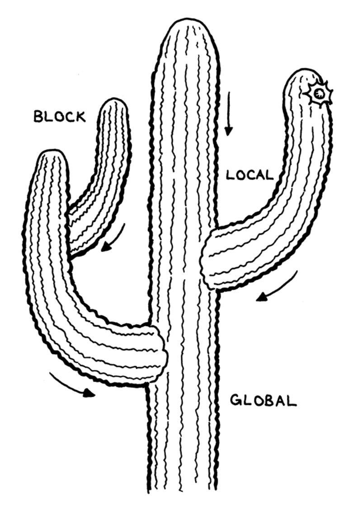

# Lox Language

## 0 Lox.java

- `main`
- `runPrompt`, `runFile`
- `run`
- `error`, `report`
  - 可能的错误来自于三个过程，不同过程的错误处理方式也不同
    - 静态过程：1.scan的时候发现不规范的字符导致的此法错误；2.pasre的时候发现无法闭合规则导致的语法错误
    - 动态过程（Runtime Error）：运行时产生的计算错误，如整数和字符串相加

---

## 1. 编译器前端：Token 定义& Scanner 的实现

### 1.1 TokenType.java

- 定义了一系列TokenType

### 1.2 Token.java

- 定义了Token类，包含了type，原文lexeme，值literal和所在的行数line

```java
class Token {
    final TokenType type;
    final String lexeme;
    final Object literal;
    final int line; 

    Token(TokenType type, String lexeme, Object literal, int line) {
        this.type = type;
        this.lexeme = lexeme;
        this.literal = literal;
        this.line = line;
    }

    public String toString() {
        return type + " " + lexeme + " " + literal;
    }
}
```

### 1.3 Scanner.java

- Scanner类的属性
  - `source`
  - `List<Token> tokens`
  - `current`, `start`, `line`
  - `keywords`

- 外部调用
  - `scanToken`

  ```java
    List<Token> scanTokens() {
        while (!isAtEnd()) {
            // We are at the beginning of the next lexeme.
            start = current;
            scanToken();
        }
        tokens.add(new Token(EOF, "", null, line));
        return tokens;
    }
  ```

>功能函数实现对全局token序列的读取和分析，维护当前的lexeme和其位置，生成Token对象保存到list中

- 功能函数
  - `advance`
  - `peek`, `peekNext`
  - `match`
  - `addToken`
  - `isAtEnd`, `isDigt`, `isAlpha`, `isAlphaNumeric`

>`scan`不采用正则表达式而用swith case的方式处理各种lexeme

- 核心函数
  - **`scan`**
  - `string`, `number`, `comment`, `identifier`

```java
switch (c) {
        //数值运算
        case '(': addToken(LEFT_PAREN); break;
        case ')': addToken(RIGHT_PAREN); break;
        case '{': addToken(LEFT_BRACE); break;
        case '}': addToken(RIGHT_BRACE); break;
        case ',': addToken(COMMA); break;
        case '.': addToken(DOT); break;
        case '-': addToken(MINUS); break;
        case '+': addToken(PLUS); break;
        case ';': addToken(SEMICOLON); break;
        case '*': addToken(STAR); break;
        case '!': addToken(match('=') ? BANG_EQUAL : BANG); break;
        case '=': addToken(match('=') ? EQUAL_EQUAL : EQUAL); break;
        case '<': addToken(match('=') ? LESS_EQUAL : LESS); break;
        case '>': addToken(match('=') ? GREATER_EQUAL : GREATER); break;
        //逻辑运算
        case 'o': if(peek()=='r') addToken(OR);break;
        case 'a':
        //注释
        case '/':
            if(match('/')){
                while(peek()!='\n'&&!isAtEnd()) advance(); 
            }
            else if(match('*')){
                comment();
            }
            else addToken(SLAH);
            break;
        //空字符，换行字符
        case ' ':break;
        case '\r':break;
        case '\t':break;
        case '\n':line++;break;
        //string
        case '"':string();break;
        default: 
        if(isDigit(c)) number();
        else if(isAlpha(c)) identifier();
        else
        Lox.error(line, "Unexcepted character."); break;//每次scan都会遍历全部的长度，每次遇到不规范的字符报一次错
    }
}
```

---

## 2. 编译器前端：AST节点定义&生成

### 2.1  Expr.java

> abstrct class，定义Expr的各个子类，均为AST的节点

- 属性
  
  - interface **`visitor`**
  
- 子类
- > 每个子类中包含自己的构造函数和一个重载的accept函数，accept的参数为visitor，在其中调用visitor对应不同expr子类的方法。该方式为java的一种设计模式——Visitor Pattern。


```java
//Expr的子类
defineAst(outputDir, "Expr", Arrays.asList(
            "Assign   : Token name, Expr value",
            "Call     : Expr callee, Token paren, List<Expr> arguments",
            "Logic    : Expr left, Token operator, Expr right",
            "Binary   : Expr left, Token operator, Expr right",
            "Grouping : Expr expression", 
            "Literal  : Object value", 
            "Unary    : Token operator, Expr right",
            "Variable : Token name"//变量
));

interface Visitor<R> {
    R visitBinaryExpr(Binary expr);
    ...
}

abstract <R> R accept(Visitor<R> visitor);

//子类中的accept重载示例
@Override
<R> R accept(Visitor<R> visitor) {
    return visitor.visitBinaryExpr(this);
}
```

### 2.2 Stmt.java

> abstract class，定义Stmt的各个子类，均为AST的节点

- 属性
  - interface **`visitor`**
- 子类

```java
defineAst(outputDir, "Stmt", Arrays.asList(
            "If         : Expr condition, Stmt thenBranch, Stmt elseBranch",
            //"For        : Stmt initializer, Expr condition, Expr increment, Stmt body",
            "Function   : Token name, List<Token> params, List<Stmt> body",
            "While      : Expr condition, Stmt body",
            "Block      : List<Stmt> statements",
            "Expression : Expr expression",
            "Print      : Expr expression",
            "Return     : Token keyword, Expr value",
            "Var        : Token name, Expr initializer"//变量的声明节点
));
```


> 将之前的expression作为statement的其中一种子类，并完善如打印、赋值等操作。

```java
interface Visitor<R> {
    R visitExpressionStmt(Expression stmt);
    R visitPrintStmt(Print stmt);
}
abstract <R> R accept(Visitor<R> visitor);

//子类中的accept重载示例
@Override
<R> R accept(Visitor<R> visitor) {
    return visitor.visitExpressionStmt(this);
}
```

### 2.3 Paeser.java

>**自底向上规则**：
>
>```java
>program     → declaration* EOF ;
>
>declaration → varDecl | funDecl	| statement ;
>
>------------------------------------
>
>funDecl  → "func" function ;
>function → IDENTIFIER "(" parameters? ")" block ;
>parameters → IDENTIFIER ( "," IDENTIFIER )* ;
>
>varDecl  → "var" IDENTIFIER ( "=" expression )? ";" ;
>
>------------------------------------
>  
>statement → exprStmt | printStmt | block | ifStmt | whileStmt | returnStmt ;
>exprStmt  → expression ";" ;
>printStmt → "print" expression ";" ;
>ifStmt    → "if" "(" expression ")" statement ("else" statemnt); //不支持else if
>whileStmt → "while" "(" expression ")" statement ;
>//在这里使用desugar将其parse为包含block的一个block，甚至无需在interpretre中新写函数
>forStmt   → "for" "(" ( varDecl | exprStmt | ";" )
>                      expression? ";"
>                      expression? ")" statement ;
>block     → "{" declaration* "}" ;
>returnStmt → "return" expression? ";" ;
>
>------------------------------------
>expression → assignment ;
>
>//若该语句是assignment，则等式的左边一定是Token而不是Expr，即左边为变量右侧为可计算值的Expr
>//但有时候左边是复杂的表达式如 makeList().head.next = node; 中，parser在遇到‘=’前都不知道
>//在parse一个l-value，如何解决这个问题？先用Expr来计算l-value，若得到Expr.Valiable则赋值
>assignment → IDENTIFIER "=" assignment | logic_or ;
> 
>logic_or       → logic_and ( "or" logic_and )* ;
>logic_and      → equality ( "and" equality )* ;
>equality       → comparison ( ( "!=" | "==" ) comparison )* ;
>comparison     → addition ( ( ">" | ">=" | "<" | "<=" ) addition )* ;
>addition       → multiplication ( ( "-" | "+" ) multiplication )* ;
>multiplication → unary ( ( "/" | "*" ) unary )* ;
>unary          → ( "!" | "-" ) unary | call ;
>//call的优先级在unary之上，在primary之后
>    call           → primary ( "(" arguments? ")" )* ;
>arguments      → expression ( "," expression )* ;
>primary        → NUMBER | STRING | "false" | "true" | "nil"	| "(" expression ")" | IDENTIFIER ;
>
>```
>     

- 属性
  - `tokens`
  - `current`
  - `List<Stmt> statements`

- 调用方法

1. ~~返回 `Expr`类~~

```java
Expr parse() {
    try {
        return expression();
    } catch (ParseError error) {
        return null;
    }
}
```

2. 返回 List\<`Stmt`>

```java
List<Stmt> parse() {
    List<Stmt> statements = new ArrayList<>();
    while (!isAtEnd()) {
        statements.add(statement());
    }

    return statements;
}
```

>功能函数和scanner的类似，实现对全局token序列的读取和分析，多了一个特殊的ParserError类(extends RuntimeException)用来处理parse过程中遇到的错误

- 功能函数
  - `advance`
  - `peek`, `previous`
  - `check`, `match`
  - `isAtEnd`
  - **`error`**
  - **`synchronize`**, `consume`
    
    - 实现对错误的处理，discard当前的tokens直到下一个条语句的开头(暂时无法处理for语句内部的token错误)

```java
private ParseError error(Token token, String message) {
    //returns it instead of throwing because we want to 
    //let the caller decide whether to unwind or not
    Lox.error(token, message);
    return new ParseError();
}
```

```java
private void synchronize() {
    advance();

    while (!isAtEnd()) {
        //Discard Tokens Until we’re right at the beginning of the next statement
        if (previous().type == SEMICOLON)
            return;

        switch (peek().type) {
            case CLASS:
            case FUN:
            case VAR:
            case FOR:
            case IF:
            case WHILE:
            case PRINT:
            case RETURN:
                return;
        }

        advance();
    }
}
```

>每个核心函数暂时只能处理一个现规则下的expr，调用Expr类中某个子类的构造函数生成该子类并返回，parser.parse()返回一个Expr子类对象，随后调用Interpreter类求值。**最后得到的expr对象实际上是一颗AST树**。

- 核心函数
  - 处理`Expr`类
    - `expression`
      - `assignment`
      - `or` && `and`
      - `equality`
      - `comparision`
      - `addtion`
      - `mutiplication`
      - `unary`
      - `primary`
      - `call`
        - `finishCall`
  - 处理`Stmt`类
    - `varDeclarationStatementn `
    - `function`
    - `statement`
      - `block`
      - `ifStatement`
      - `whileStatement`
      - `forStatement`
      - `printStatement`
      - `expressionStatement`
      - `varDeclarationStatement`

```java
// 将for解析为blockStmt节点，实现desugaring
    private Stmt forStatement() {
        consume(LEFT_PAREN, "Expect '(' after 'for'.");
        Stmt initializer;
        if (match(SEMICOLON)) {
            initializer = null;
        } else if (match(VAR)) {
            initializer = varDeclaration();
        } else {
            initializer = expressionStatement();
        }

        Expr condition = null;
        if (!check(SEMICOLON)) {
            condition = expression();
        }
        consume(SEMICOLON, "Expect ';' after loop condition.");

        Expr increment = null;
        if (!check(RIGHT_PAREN)) {
            increment = expression();
        }
        consume(RIGHT_PAREN, "Expect ')' after for clauses.");

        Stmt body = statement();

        if (condition == null) condition = new Expr.Literal(true);
        if (increment != null) {
            body = new Stmt.Block(Arrays.asList(body, new Stmt.Expression(increment)));
        }
        body = new Stmt.While(condition, body);

        if (initializer != null) {
            body = new Stmt.Block(Arrays.asList(initializer,body));
        }
              
        return body;
    }
```

```java
//调用方法，不支持将函数作为对象？funcA(**args)(funcB(**args))
		private Expr call() {
        Expr expr = primary();
        while(true){
            if (match(LEFT_PAREN)) {
              	//第一次执行玩call的结果作为第二次的callee
                expr = finishCall(expr);
            }
            else break;
        }

        return expr;
    }

    private Expr finishCall(Expr callee) {
        List<Expr> arguments = new ArrayList<>();
        if (!check(RIGHT_PAREN)) {
            do{
                arguments.add(expression());
            } while(match(COMMA));
        }
        Token paren = consume(RIGHT_PAREN, "Expect ')' after arguments.");
        return new Expr.Call(callee,paren,arguments);
    }
```

---

## 3 编译器前端：Parse阶段AST中的Local变量合法性检查

### 3.1 [Resolver.java](./src/com/craftinginterpreters/lox/Resolver.java)

> After the parser produces the syntax tree, but before the interpreter starts executing it, we’ll do a single walk over the tree to resolve all of the variables it contains.
>
> 用一个mini-interpreter来对AST进行剪枝，主要解决变量绑定的问题，和interpreter一样是对visitor接口的implement，但只专注变量的管理，通过一个栈来管理当前的scope，在新的scope中，每个新声明的变量都有一个boolean值来确认其是否已经初始化。如此一来即可在parse阶段完成多次声明后的冲突。

- 目标节点
  - A block statement introduces a new scope for the statements it contains.
  - A function declaration introduces a new scope for its body and binds its parameters in that scope.
  - A variable declaration adds a new variable to the current scope.
  - Variable and assignment expressions need to have their variables resolved.
  
- 属性

  - private final Interpreter `interpreter`
  - private final Stack<Map<String,Boolean>> `scopes` = new Stack<>()
    - 每一个scope包含在其中声明的variable，以完成变量的合法性检查
  - private FunctionType currentFunction = FunctionType.NONE.
    - 指示当前处于那类function体中，用来检测一些语法错误如不在function内的return语句

- 构造方法

  - Resolver(Interpreter interpreter) {this.interpreter = interpreter;} 绑定interpreter

- 调用方法

  - ​	`resolve(List<\Stmt> statements)`

- 辅助函数

  - 三种`resolve` 分别对应输入参数为Expr、Stmt和List<\Stmt>，通过accept调用自身子类的visit接口，完成变量名的检查
  - `resolveLocal` 在scopes栈中依次向前寻找包含该变量的scope，调用Interpreter的resolve方法
  - `resolveFunction` 新建一个scope，将函数声明中的参数分别`declare`、`define`后，再对body进行resolve，完成函数内部的变量合法性检查

- 重载visitXXX接口

  - 在不涉及到变量赋值、声明和block时，直接调用resolve来进行变量检查。
    
    - 1. 在变量的声明中，首先`declare`变量，随后通过`resolve`检查initializer，没有问题则`define`变量，结束后
    
    - 2. 在函数的声明中，首先`declare`、`define`函数名，随后通过`resolveFunction`检查body中的变量使用
  3. 在block中，首先新建一个scope，通过`resolve`检查body中所有的statements后结束当前的scope
    
- `Expr`类
  
    - `visitLogicExpr`
    - `visitLiteralExpr`
  - ....
  
- `Stmt`类
  
    - `visitBlockStmt`
  - .....
  
  


---

## 4 编译器后端：解释执行AST

### 4.1 Interpreter.java

>implements Expr.Visitor\<Object>, Stmt.Visitor\<Void> 完善之前定义类的visit接口
>
>void不是函数，是方法的修饰符，void的意思是该方法没有返回值，意思就是方法只会运行方法中的语句，但是不返回任何东西。 java.lang.Void是一种类型。例如给Void引用赋值null。通过Void类的源代码可以看到，Void类型不可以继承与实例化。
>[其他用法参考此博文](https://blog.csdn.net/f641385712/article/details/80409211)

- 属性
  
  - final Environment `globals` = new Environment()
  - private Environment `environment` = globals
- 辅助函数
  
  - `isTruthy`, `isEqual`
- 调用方法
  - **`interpret`**
- 依次调用List\<Stmt>中的statement
  
- **`execute`**
  
    - 调用Stmt对象的accept方法中的visit接口来执行该节点
    
  - **`evaluate`**
    - 调用expr对象的accept方法计算单个expressiong的值
    
  - 总体的调用顺序为: **`interpret`**→`execute`→`evaluate`→`visitXXXX`
- 重载visitXXX接口
  - `Expr`类
    - `visitLogicExpr`
    - `visitLiteralExpr`
    - `visitGroupingExpr`
    - `visitUnaryExpr`
    - `visitBinaryExpr` 根据left、right和operator来做运算，本质上是一个Post Order遍历树的过程
    - `visitVariableExpr`
  - `Stmt`类
    - `visitBlockStmt`
      - `executeBlock` 新建一个local环境来执行当前的block
    - `visitExpressionStmt`
    - `visitPrintStmt`
    - `visitVarStmt`
    - `visitIfStmt`
    - `visitWhileStmt`
      - #TODO 怎么新增对break的支持？

```java
@Override
public Object visitBinaryExpr(Expr.Binary expr) {
    Object left = evaluate(expr.left);
    Object right = evaluate(expr.right);

    switch (expr.operator.type) {
        case GREATER:
            return (double) left > (double) right;
        case GREATER_EQUAL:
            return (double) left >= (double) right;
        case LESS:
            return (double) left < (double) right;
        case LESS_EQUAL:
            return (double) left <= (double)right;
        case MINUS:
            checkNumberOperand(expr.operator, right);//处理runtime error
            return (double) left - (double) right;
        case PLUS://string和number都有plus操作
            if (left instanceof Double && right instanceof Double) {
            return (double)left + (double)right;
            } 
            if (left instanceof String && right instanceof String) {
            return (String)left + (String)right;
            }
        case SLASH:
            return (double) left / (double) right;
        case STAR:
            return (double) left * (double) right;
        case BANG_EQUAL: return !isEqual(left, right);
        case EQUAL_EQUAL: return isEqual(left, right);
    }

    // Unreachable.
    return null;
}
```

- `executeBlock`函数，新建一个scope来执行块
  - 当前的解决方案是把interpreter的environment进行替换，保存之前的环境作为previous，最后再进行恢复。如此一来没有local和global之分，interpreter始终在global中执行。这种解决方案的缺点在于相当浪费内存，而且效率不高。
  - 另一种更优雅的方式为：在每个visitXXX接口中将当前的environment作为一个参数输入，不采用是因为有些麻烦👀

```java
@Override
public Void visitBlockStmt(Block stmt) {
    executeBlock(stmt.statements, new Environment(environment));//执行block时需要新建一个scope
    return null;
}

private void executeBlock(List<Stmt> statements, Environment environment) {
    Environment previous = this.environment;//储存当前Interpreter的env
    try{
        this.environment = environment;//用新的scope覆盖当前的Interpreter的env
        for(Stmt statement : statements){
            execute(statement);
        }
    } catch (RuntimeError error){
        Lox.runtimeError(error);
    } finally {
        this.environment = previous;//恢复之前的env
    }
}
```

### 4.2 LoxFunction.java

> 对LoxCallable抽象接口的一种implement

- 属性
  - private final Stmt.Function `declaration` AST节点
  - private final Environment `closure` 上层函数的作用域
- 方法
  - `arity` 返回参数个数
  - `toString` 返回函数名称
  - `call`(interpreter, arguments) 调用传入的interpreter，根据arguments更新closure后调用executeBlock来执行

```java
		@Override
    public Object call(Interpreter interpreter, List<Object> arguments) {//arguments是param在evaluate之后的Object
        Environment environment = new Environment(closure);//使用上层函数传递的closure而不是global作为当前执行的环境
        //在当前environment中绑定function.params中的各个Token和其Object
        for (int i = 0; i < declaration.params.size(); i++) {
            environment.define(declaration.params.get(i).lexeme, arguments.get(i));
        }

        try {
            interpreter.executeBlock(declaration.body, environment);
        } catch (Return returnValue) {
            return returnValue.value;
        }

        return null;//函数没有返回值则返回null
    }
```

### 4.3 LoxCallable.java

> ​	可调用接口的抽象接口  #Question: 这里为什么要设计成接口？

- 属性
  - int arity();//需要的参数的数量
  - Object call(Interpreter interpreter, List<\Object> arguments);
  - String toString();//在print时被调用

### 4.4 Return.java

> 继承RuntimeException的类，实现return跳出当前的页帧并返回值到上一个页帧（默认没有return则返回null）

- 属性
  - final Object `value`
- 构造方法
  - Return(Object value){ super(null, null, false, false);  this.value = `value`; }


## 4. 环境管理：全局变量和局部变量



### 5.1 Environment.java

> 全局变量和局部变量的覆盖关系如上图所示，local scope中的变量继承上一层级，在该scope中发生的修改会在该scope中生效（即覆盖shadow），但在该scope结束后恢复到进入前的状态。
>
> 要实现上述的目标，理想的形式是使用链状的数据结构来管理所有的环境变量

- 属性

  - Environment `enclosing`
  - Hashmap `values`

- 构造方法

  - Environment ( ) { enclosing = null; }
  - Environment (Environment enclosing) { this.enclosing = enclosing; }
  
- 调用方法

  - > #Question 为什么这里一个用String，一个用Token？?

  - `define(String name,Object value)`

  - `ancestor (int distance)` 根据distance顺着enclosing链表向上找到目标enclosing
  
  - `get(Token token)`
  
  - `getAt（int distance, Token name）`
  
  - `assign`

### 5.2 Closure

- 当前每个函数的closure其实是指向当前environment的对象指针，在当前的environment发生变化后closure也会随之发生变化，造成可能多次执行函数的结果不同，为了解决这个问题，需要引入Persistent Environment。
- **persistent data structures**：在每次使用data时创建一个新的副本而不是指向当前的data

---


